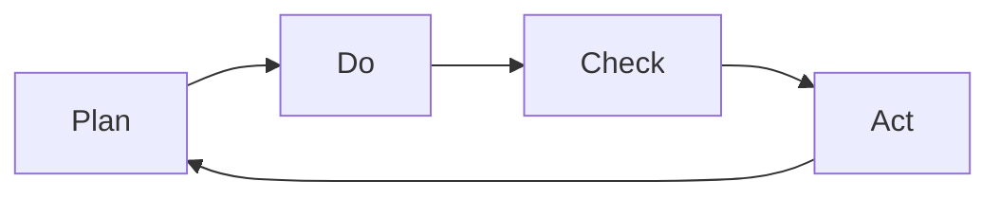
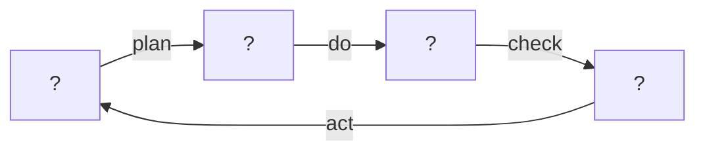
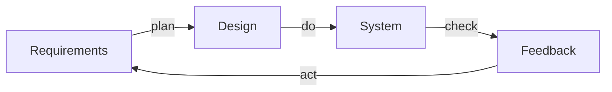
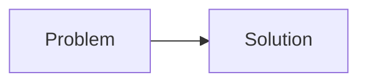
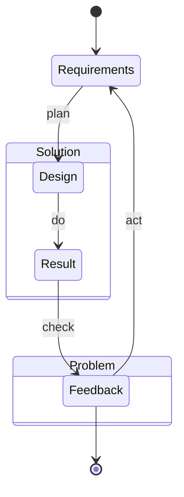
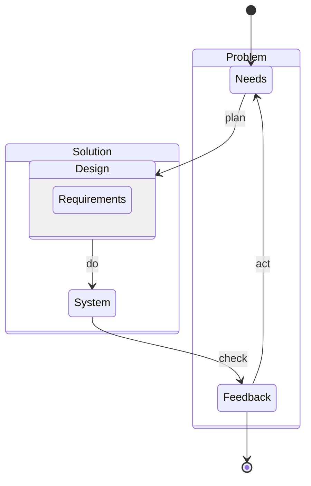
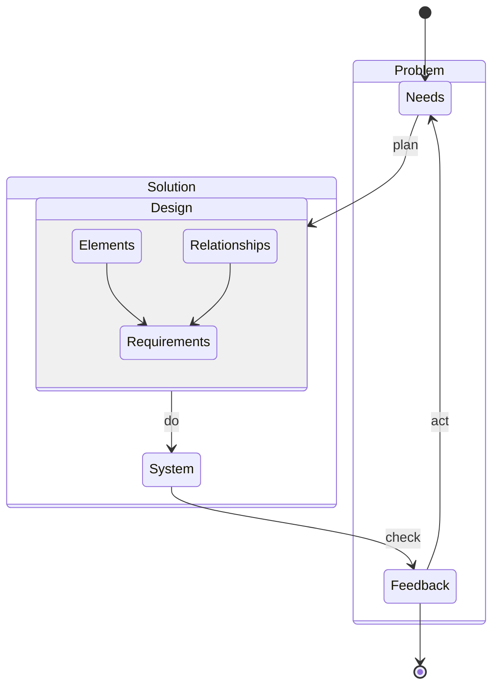
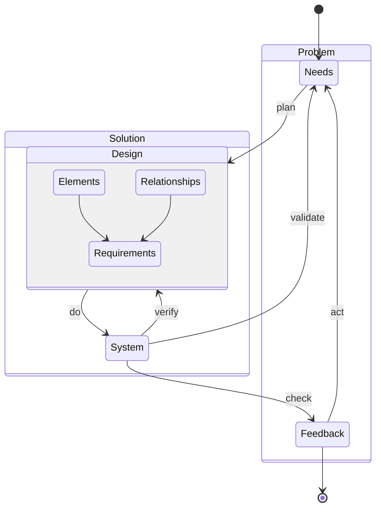
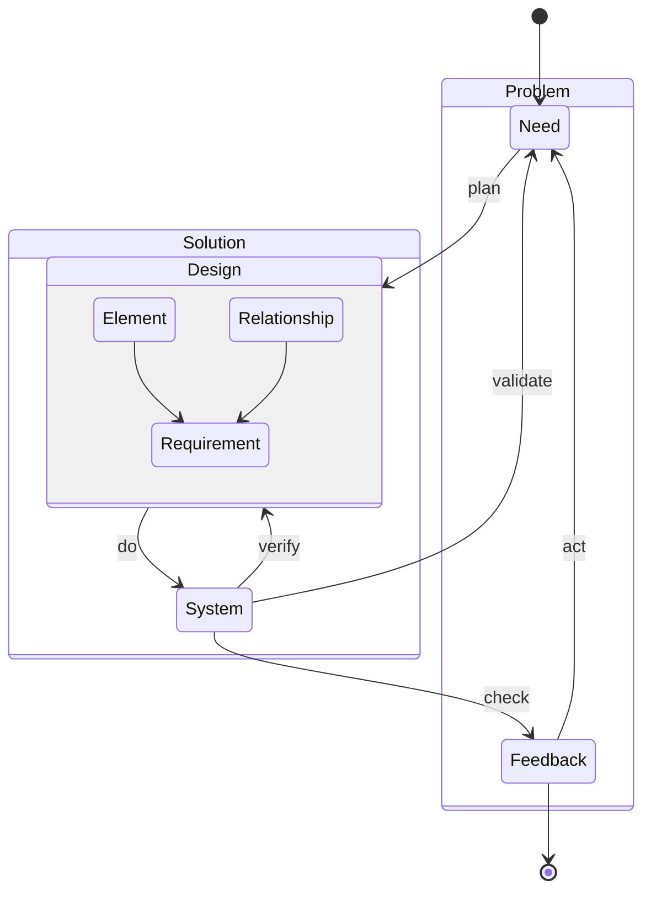
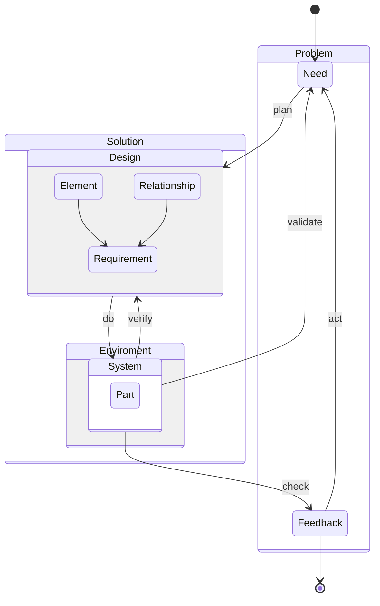

# Process as a System II: A Unified Development Lifecycle Model for Systems Engineering

## Introduction

### Concepts don't quite fit
1. V-Model creates unnecessary abstraction at the architecture/integration level
2. Agility is perceived as a counter to v-model, which it is not
3. PDCA is too high level

### First principles
1. Establish purpose
2. Understand elements and their function
3. Challenge pre-existing concepts
4. Re-align the model towards the purpose

## Scope of this Document
### PDCA
### V-Model
### Agility
### Design Thinking
### Systems Thinking
### What's in
### What's out?

## Unified Development Lifecycle Model

### The purpose of a development lifecycle

*TODO*

### Activities and Artifacts shape the development lifecycle

*TODO*

#### Activities
*TODO*

*TODO*

#### Activities transform Artifacts
*TODO*

*TODO*

#### High level artifacts
*TODO*

*TODO*

### Problem space solution space

#### Requirements connect Problem space with solution space

Doesnt really make much sense.

#### Needs and Requirements

1. Stakeholder requirements vs System requirements
2. Needs preferred to stakeholder requirement
3. Needs are problem artifacts
4. Requirements are design artifacts

### ???

What are design artifacts?

#### V-model

#### Maturity dimension

##### Iterations

##### Quality

#### System of systems

#### Documents

##### Entities