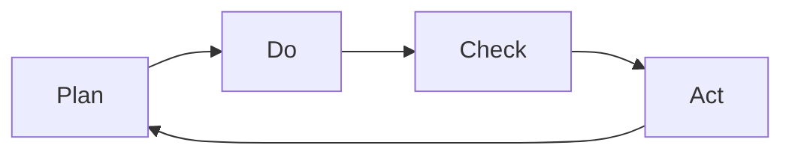
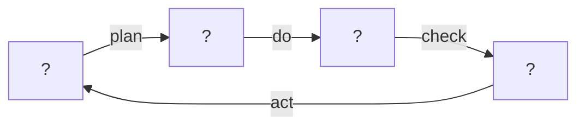
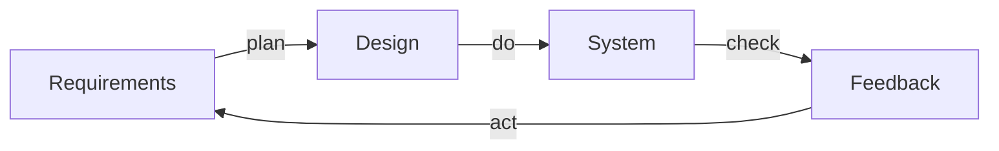
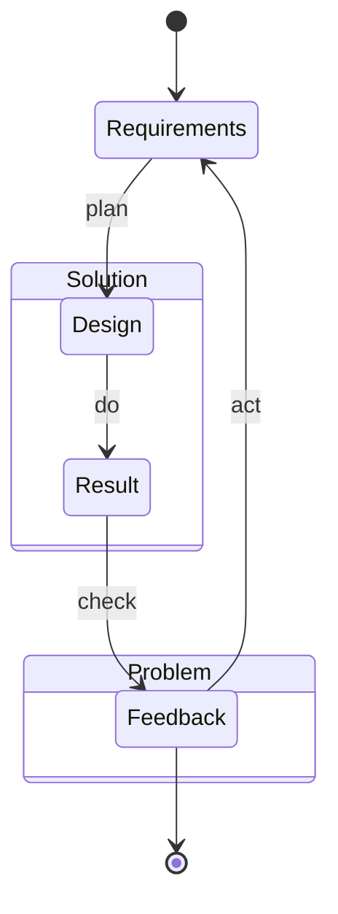
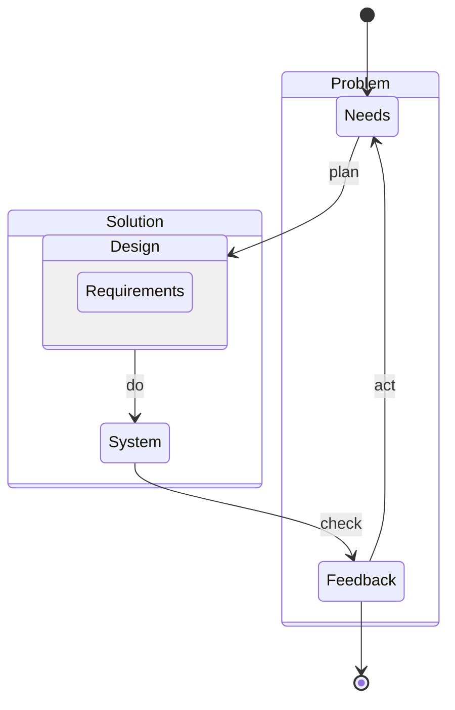
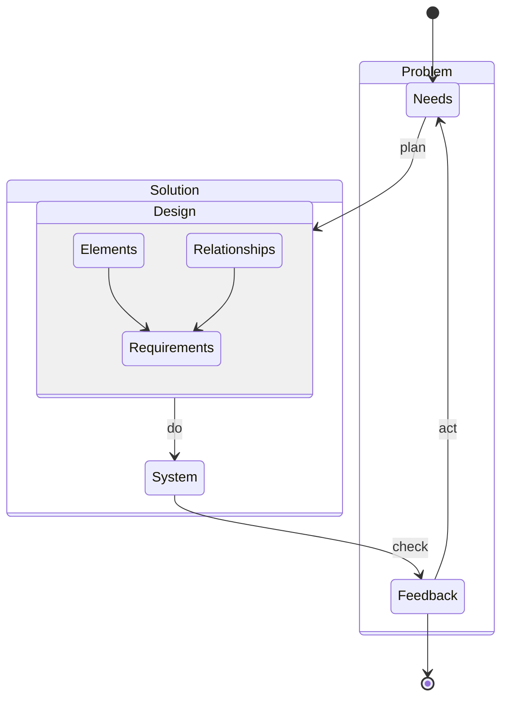
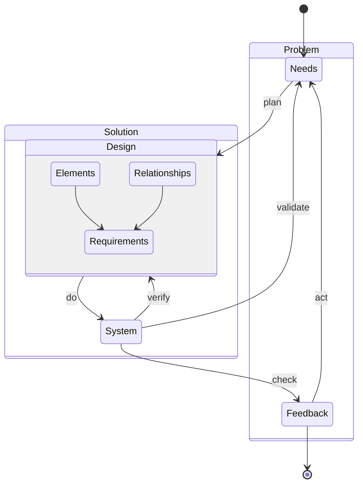
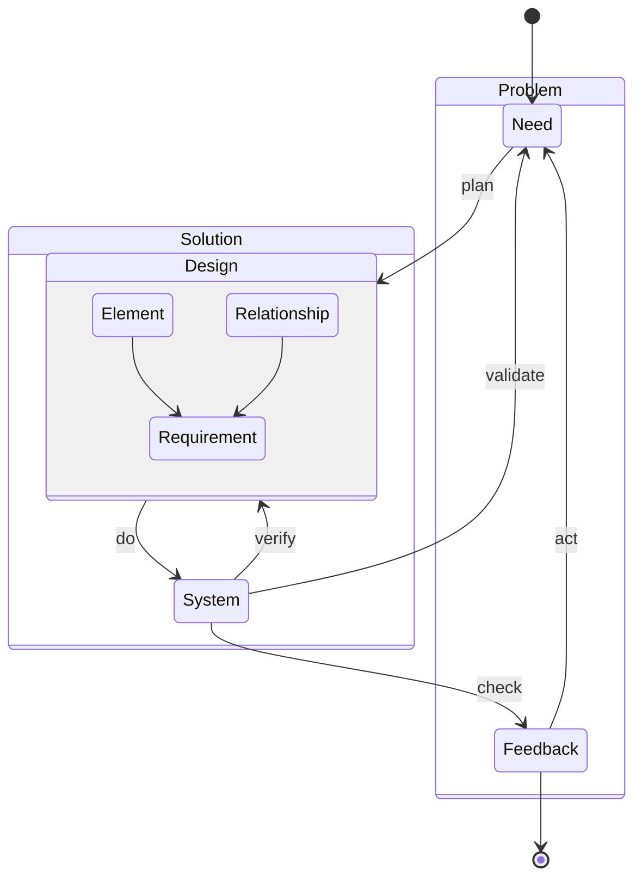
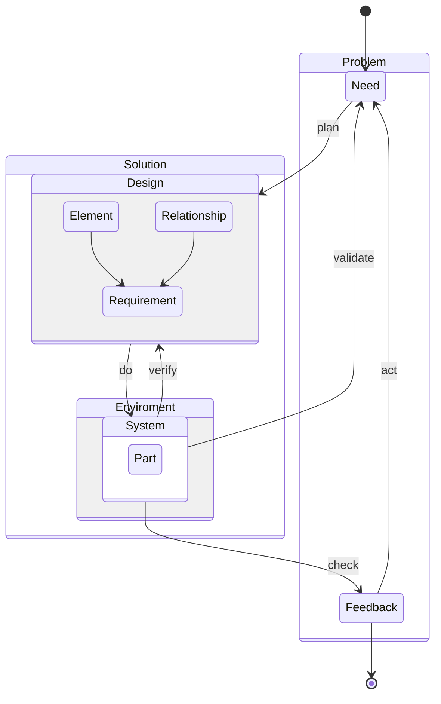

# Process as a System II: A Unified Development Lifecycle Model for Systems Engineering

## Introduction
### Issue
### Concepts
### First principles

## Scope
### What's in
### what's out 

## PCDA cycle
### How its known

### Its actually activities

### Whats in between

## Problem space solution space

### Requirements connect Problem space with solution space

1. Doesnt really make much sense.

### Needs and Requirements

1. Stakeholder requirements vs System requirements
2. Needs preferred to stakeholder requirement
3. Needs are problem artifacts
4. Requirements are design artifacts

## ???

What are design artifacts?

### V-model

### Maturity dimension

#### Iterations

#### Quality

### System of systems

### Documents

#### Entities