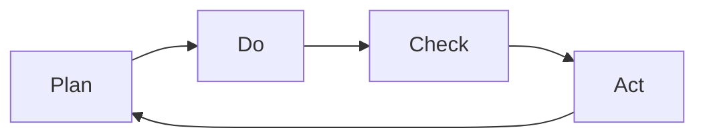
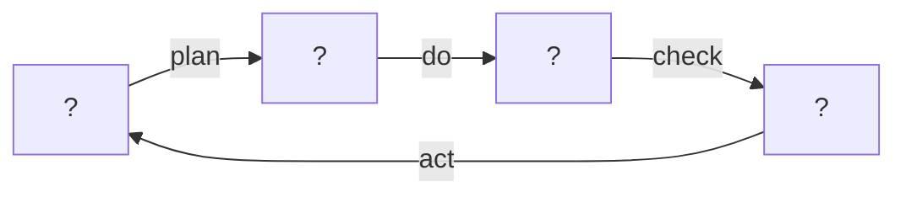
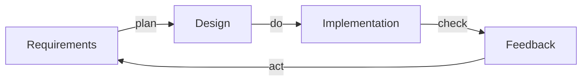
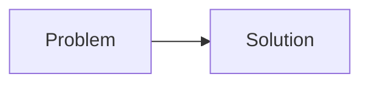
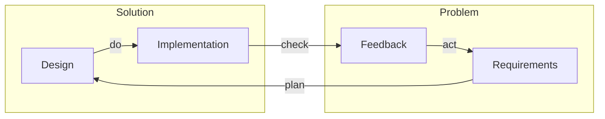
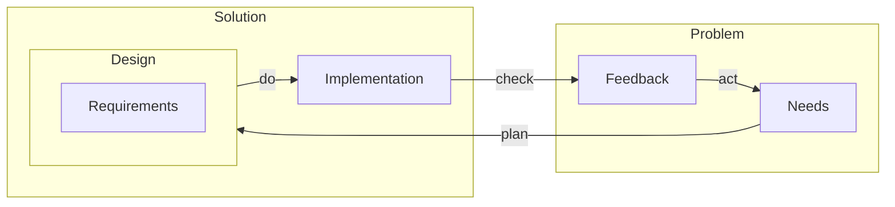
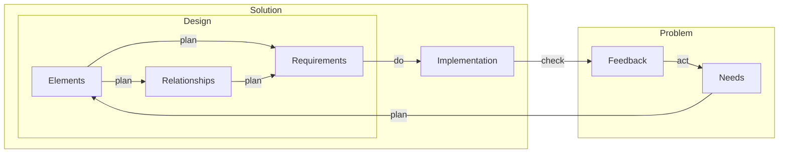
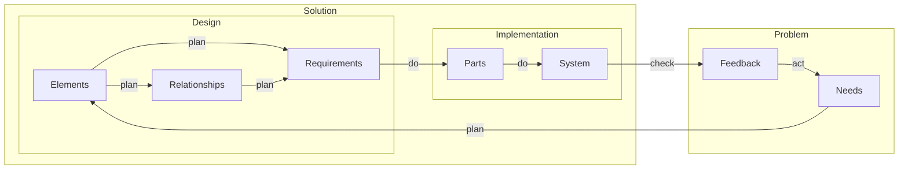
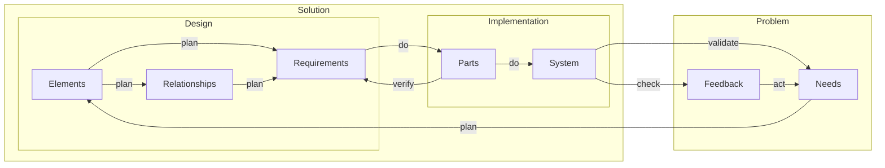
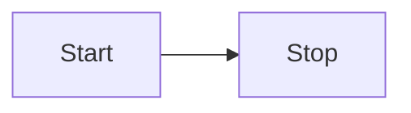

# Process as a System II: A Unified Development Lifecycle Model for Systems Engineering

## Introduction

### Concepts don't quite fit
1. V-Model creates unnecessary abstraction at the architecture/integration level
2. Agility is perceived as a counter to v-model, which it is not
3. PDCA is too high level

### First principles
1. Establish purpose
2. Understand elements and their function
3. Challenge pre-existing concepts
4. Re-align the model towards the purpose

## Scope of this Document
### Practical examples
### Flow of development activities
### Hierarchy of development artifacts
### Requirements of activities & artifacts
### Model
### What's in
### What's out?

## Unified Development Lifecycle Model

### The purpose of a development lifecycle

1. *The development lifecycle model shall guide the required activities and artifacts, to ensure the development achieves its purpose*
2. *The development purpose, shall include customer satisfaction, to ensure that customer needs are met.*

### Plan, Do, Check, Act

*Each step is an activity*

### Activities and Artifacts shape the development lifecycle

*TODO*

*Activities transform artifacts*

### Activities transform Artifacts
*TODO*

*TODO*

### Problem space solution space

1. The house shall be energy efficient.

### Requirements connect Problem space with solution space

Requirements
1. The heating system should use less than 100g carbon dioxide equivalent.

#### Keeping the problem space and solution space separate

1. Stakeholder requirements vs System requirements
2. Needs preferred to stakeholder requirement
3. Needs are problem artifacts
4. Requirements are design artifacts

#### ???

What are design artifacts?

#### System of systems

#### V-model

#### Start Stop

#### Maturity dimension

##### Iterations

##### Quality

#### System of systems

#### Documents

##### Entities