# Process as a System II: An Organic Development Lifecycle Model for Systems Engineering

## Introduction

### Organic development for organic resources
1. V-Model creates unnecessary abstraction at the architecture/integration level
2. Agility is perceived as a counter to v-model, which it is not
3. PDCA is too high level

### First principles
1. Establish purpose
2. Understand elements and their function
3. Challenge pre-existing concepts
4. Re-align the model towards the purpose

## Scope of this Document

### The purpose of a development lifecycle
1. The development lifecycle model shall guide the required activities and artifacts, to ensure the development achieves its purpose.
2. The development purpose, shall include customer satisfaction, to ensure that customer needs are met.
### Practical example
3. Building an energy efficient house
   1. Some of the work can only be done in a series
   2. Some of the work can be parallel
### Flow of development activities
### Hierarchy of development artifacts
### Requirements of activities & artifacts
### Model
### What's in
### What's out?

## An organic flow of development activities

### The fundamental development elements

#### The Deming(?) cycle
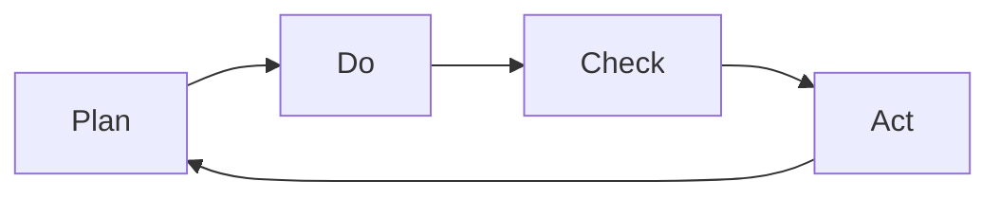
*Each step is an activity*

#### Activities and Artifacts shape the development lifecycle

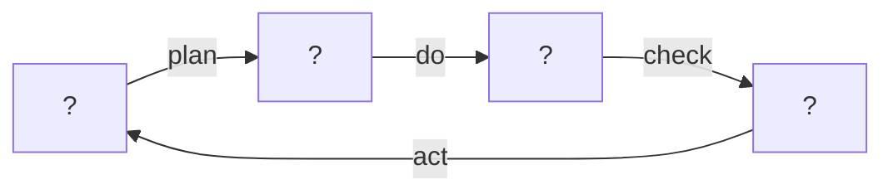

#### Activities transform Artifacts

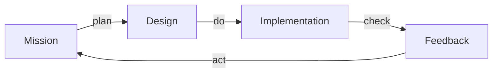

### Problem space solution space

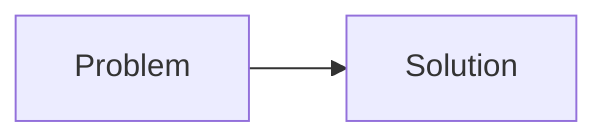

1. The house shall be energy efficient.

#### Requirements connect Problem space with solution space

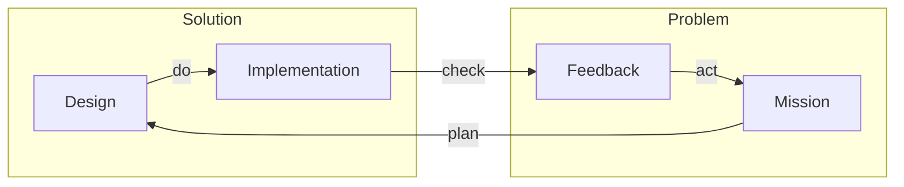

The heat pump should create less than 100g carbon dioxide equivalent.

### Design Thinking

#### Keeping the problem space and solution space separate

1. "Technical" requirements is meaningless
2. Stakeholder needs vs System requirements
   1. 
3. Needs preferred to stakeholder requirement
4. Needs are problem artifacts
5. Requirements are design artifacts

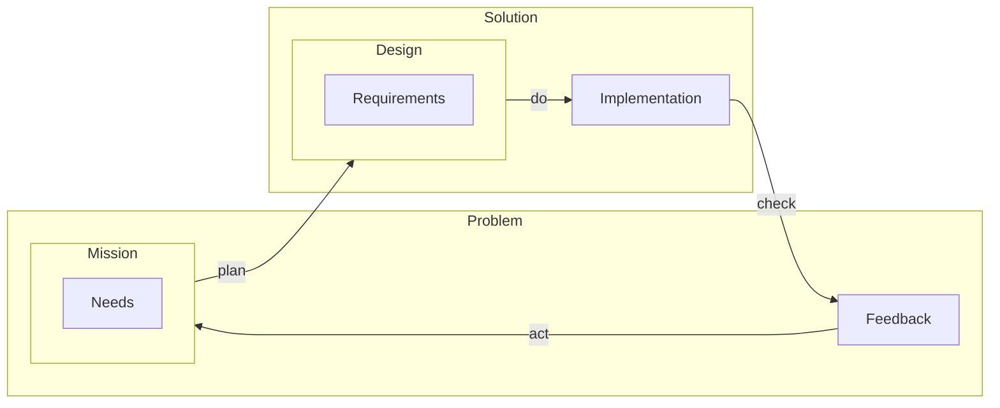
### Systems Thinking

### Building blocks of a system model

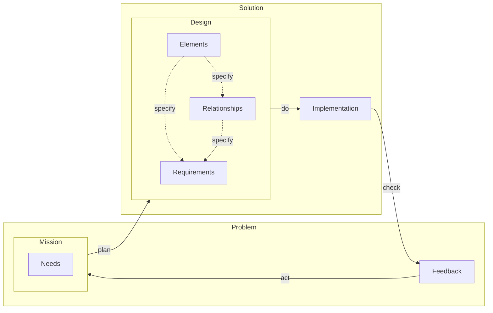

### System of systems

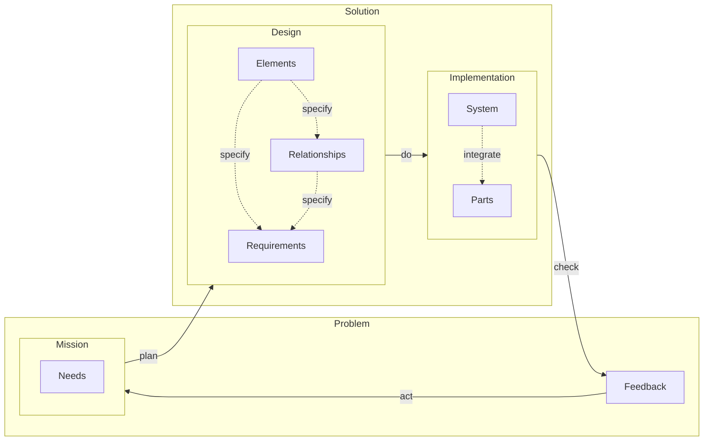

### Mission control

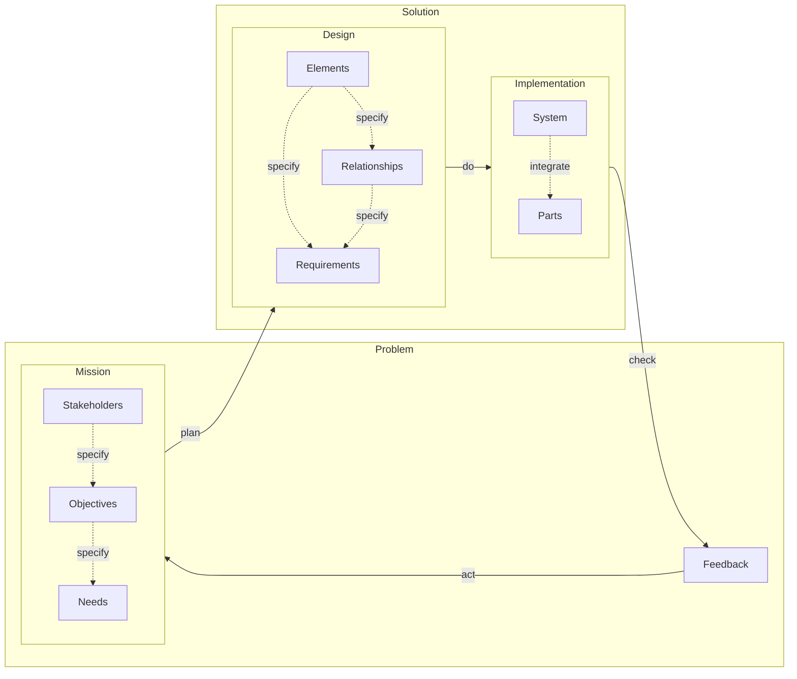

### V-model

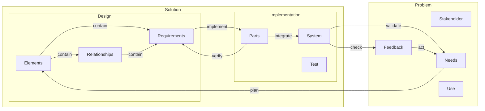

### System of systems

#### Maturity & Iterations

- 2 week iteration makes no sense, depends on depths of design and implementation for a single need

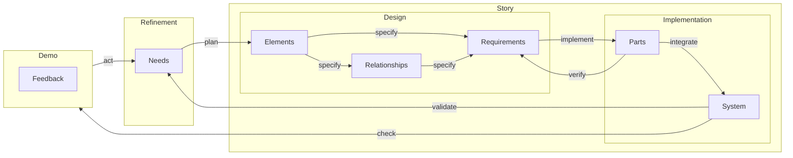

### Quality

## An organic hierarchy of development artifacts

### Negative effect of documents

### Entities

## Summary

### Development flow
