# Process as a System II: An Organic Development Lifecycle Model for Systems Engineering

## Introduction

### Organic development
1. Development is done by humans
2. Needs to be executable organically by humans
3. Some issues with system development are caused by inorganic processes
   1. Against human thought process
      1. Requirements, Architecture, Implementation
   2. Against physical existence
      1. Documents and specification

Systems development (for the time being) is conducted by human beings with the support of technology through tools, software, and electronics. While a lot of focus is set on the technology aspect of systems engineering, little attention is given to the human aspects regarding the understanding and performance of systems engineering processes.

### Illusion of explanatory depth
   1. The sense that one understands complex issues more deeply than one does.
      1. Quickly rate knowledge of various issues x/10 (t1 rating)
      2. Ask to deeply one issue
      3. Re-rate the knowledge of issue (t3 rating)

We seldomly are asked to really explain a concept.

*See: intellectual humility*

Questions:
- What is the appropriate level of detail for architectural and detailed design?
- What is the appropriate breakdown of requirements?
- How do I identify integration tests?

*It depends is not a valid answer: It depends on WHAT? Necessary to DO WHAT?*

## Scope of this Document

### First principles thinking
1. Establish purpose
2. Understand elements and their function
3. Challenge pre-existing concepts
4. Re-align the model towards the purpose

### Real world development
1. Development concepts should suit to real world practice
2. Existing development concepts 
   1. V-Model creates unnecessary abstraction at the architecture/integration levelx
   2. Agility is perceived as a counter to v-model, which it is not
   3. PDCA is too high level
3. Building an energy efficient house
   1. Some of the work can only be done in a series
   2. Some of the work can be parallel

### No difference between system/software/hardware/mechanic

### Hierarchy model for development artifacts

### Algorithm for development activities

## An organic flow of development activities

### The purpose of a development lifecycle
1. The development lifecycle model shall guide the required activities and artifacts, to ensure the development achieves its purpose.
2. The development purpose, shall include customer satisfaction, to ensure that customer needs are met.

### The fundamental development elements

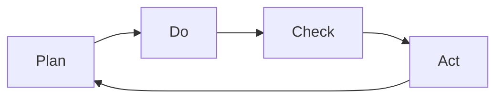
*Each step is an activity*

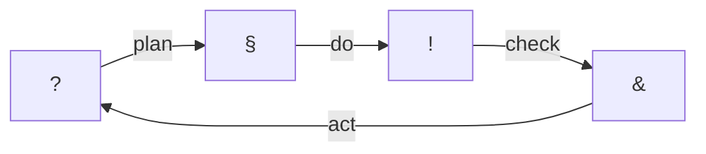

### Keeping the problem space and solution space separate

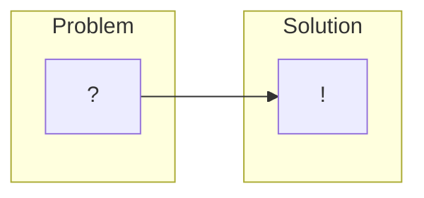

1. The house shall be energy efficient.

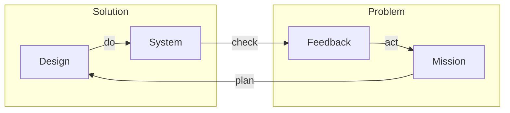

The heat pump should create less than 100g carbon dioxide equivalent.

1. "Technical" requirements is meaningless
2. Stakeholder needs vs System requirements
   1. 
3. Needs preferred to stakeholder requirement
4. Needs are problem artifacts
5. Requirements are design artifacts

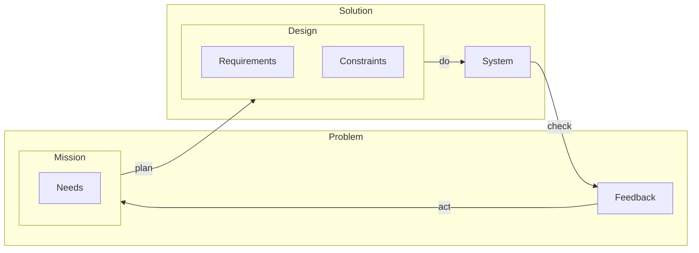

### Mission control

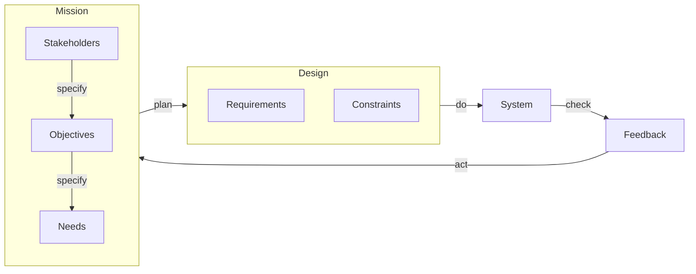

### System of systems

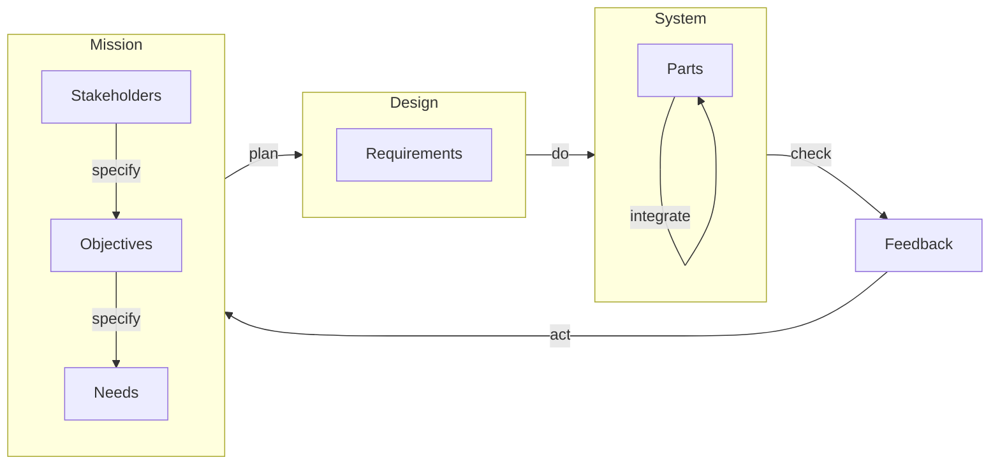

### Systems thinking

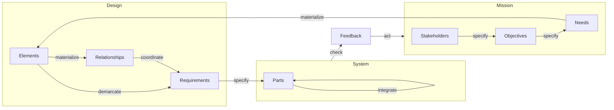

|||
|---|---|
|Objective|A system with no unnecessary parts, every part serves the system purpose|
|Need|A design that defines every required part|
|Requirements||
-  A model shall ???
-  An element shall represent the boundaries of a to be implemented part of the system.
-  An element may contain other elements to the detail necessary for the definition of relationships or requirements.
-  An element may contain relationships
-  An element shall contain requirements
-  A relationship shall represent the actions or dependencies of a to be implemented part of the system to another.
-  A relationship should have a equal reaction???
-  A relationship should contain requirements

### V-model

Reverse direction

Integration tests: All tests that verify requirements

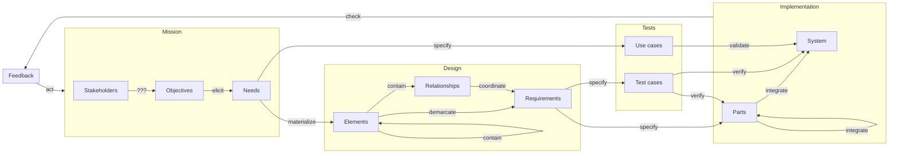

## An organic hierarchy of development artifacts

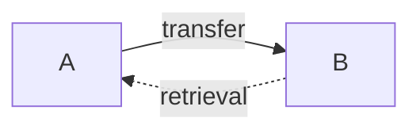

### Negative effect of documents

### Entities

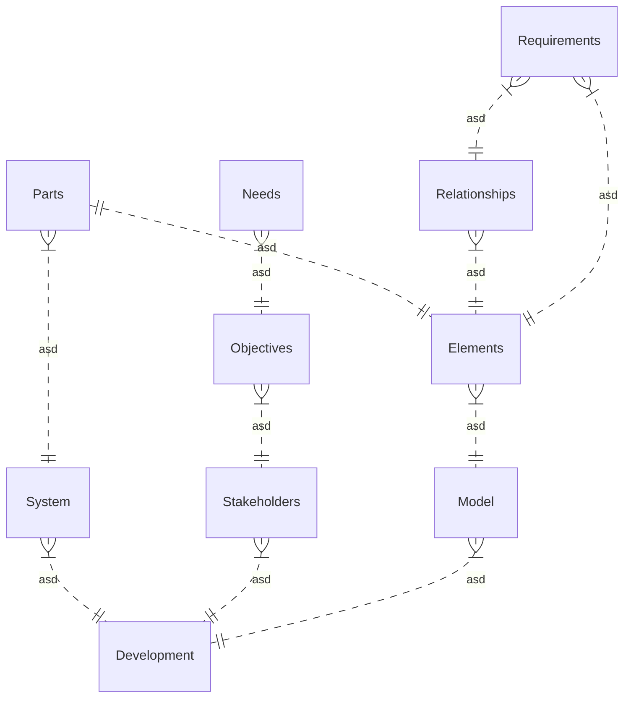

      Requirements }|..|| Needs : asd
      Requirements ||..|| Parts : asd

## Summary

### Development flow

## Addendum

### Agile

Works as well -> Stories

Implications:
- 2 weeks makes no sense

### System of systems

#### Maturity & Iterations

- 2 week iteration makes no sense, depends on depths of design and implementation for a single need

### Quality
