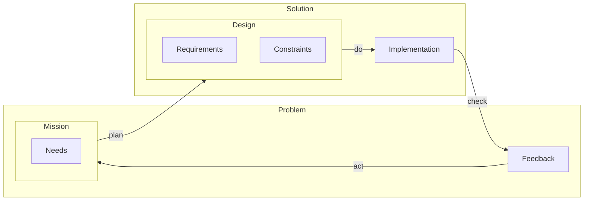
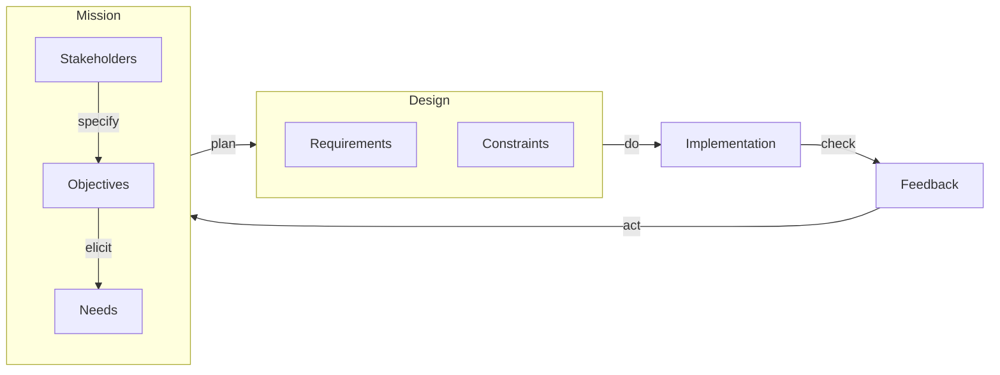
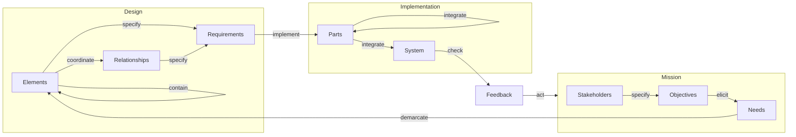
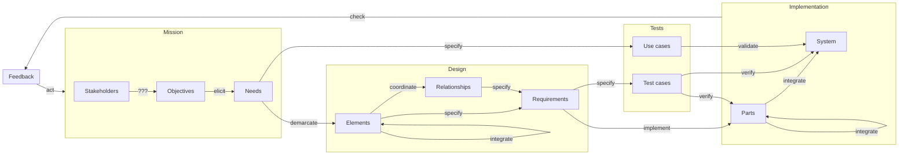

# Process as a System II: An Organic Development Lifecycle Model for Systems Engineering

## Introduction

### Organic development
1. Development is done by humans
2. Needs to be executable organically by humans
3. Some issues with system development are caused by inorganic processes
   1. Against human thought process
      1. Requirements, Architecture, Implementation
   2. Against physical existence
      1. Documents and specification

Systems development (for the time being) is conducted by human beings with the support of technology through tools, software, and electronics. While a lot of focus is set on the technology aspect of systems engineering, little attention is given to the human aspects regarding the understanding and performance of systems engineering processes.

### Illusion of explanatory depth
   1. The sense that one understands complex issues more deeply than one does.
      1. Quickly rate knowledge of various issues x/10 (t1 rating)
      2. Ask to deeply one issue
      3. Re-rate the knowledge of issue (t3 rating)

We seldomly are asked to really explain a concept.

*See: intellectual humility*

Questions:
- What is the appropriate level of detail for architectural and detailed design?
- What is the appropriate breakdown of requirements?
- How do I identify integration tests?

*It depends is not a valid answer: It depends on WHAT? Necessary to DO WHAT?*

### Hill climbing

Incremental improvement finds local maxima
Finding the global maximum requires non-incremental improvement

## Scope of this Document

### First principles thinking
1. Establish purpose
2. Understand elements and their function
3. Challenge pre-existing concepts
4. Re-align the model towards the purpose

### Real world development
1. Development concepts should suit to real world practice
2. Existing development concepts 
   1. V-Model creates unnecessary abstraction at the architecture/integration levelx
   2. Agility is perceived as a counter to v-model, which it is not
   3. PDCA is too high level
3. Building an energy efficient house
   1. Some of the work can only be done in a series
   2. Some of the work can be parallel

### No difference between system/software/hardware/mechanic

### No difference between unit/component

### Design is not documentation

### Hierarchy model for development artifacts

### Algorithm for development activities

## An organic flow of development activities

### The purpose of a development lifecycle
1. The development lifecycle model shall guide the required activities and artifacts, to ensure the development achieves its purpose.
2. The development purpose, shall include customer satisfaction, to ensure that customer needs are met.

### The fundamental development elements

*Each step is an activity*

### Keeping the problem space and solution space separate

1. The house shall be energy efficient.

The heat pump should create less than 100g carbon dioxide equivalent.

1. "Technical" requirements is meaningless
2. Stakeholder needs vs System requirements
   1. 
3. Needs preferred to stakeholder requirement
4. Needs are problem artifacts
5. Requirements are design artifacts

### Mission control

### System of systems

### Systems thinking

Relationship instead of interaction, interface, dependency
Design vs Code generation
Elements <-> Parts

|||
|---|---|
|Objective|A system with no unnecessary parts, every part serves the system purpose|
|Need|A design that defines every required part|
|Requirements||
-  A model shall ???
-  An element shall represent the boundaries of a to be implemented part of the system.
-  An element may contain other elements to the detail necessary for the definition of relationships or requirements.
-  An element may contain relationships
-  An element shall contain requirements
-  A relationship shall represent the actions or dependencies of a to be implemented part of the system to another.
-  A relationship should have a equal reaction???
-  A relationship should contain requirements

### V-model

The v-model introduces the aspect of verifying the system based on the defined design and validating based on the defined needs. This ensures two crucial objectives within system engineering, building the right system (validation), the right way (verification).

*TODO: Add image v-model*

One of the common issues with the v-model is the question of: what is the appropriate level of detail for testing? It establishes abstraction layers between unit tests, integration tests, qualification tests, acceptance tests, and so on. These artificial separations are based on the separation of units, components, architectural design and detailed design.
Yet, there is no common definition of what each of those artifacts are, or how to identify them. They are largely based on individual organizational needs and add little benefit to the development process itself. Even worse, when used to structure organizations they create process separations that are here to stay.

With the use of an organic design model verification strategies can be appropriately applied, as the focus of the verification can be determined by an element's position and surroundings in the model. An implemented part can be tested according to the requirements that are directly specified for its element in the model. Once integrated, the element’s relationships and their requirements determine the integration tests. After all (planned) parts are integrated and the system is to be base lined, all verification tests can be executed. This approach offers a nuanced and automate-able approach to verification testing without the need for an artificial hierarchy of units, parts, and components.

|||
|---|---|
|Objective|A system that fulfils the |
|Need|A system that satisfies the stakeholder needs|
|Need|The system parts are implemented according to the design|
|Need|The system is implemented according to the design|
- **Test cases**
  - Test cases verify the achievement of the requirement
  - **Verify Parts**
    - After implementation of a part, verify all requirements of its respective element via their respective test cases.
    - After integration of a part, verify all requirements of its respective element's relationships via their respective test cases.
  - **Verify System**
    - After integration of all relevant parts into the system, verify all requirements via their respective test cases.
- **Use cases**
  - **Validate System**
    - After integration of all relevant parts into the system, validate all needs via their respective use cases.

## An organic hierarchy of development artifacts

### Negative effect of documents

### Entities

      Requirements }|..|| Needs : asd
      Requirements ||..|| Parts : asd

## Summary

- Requirements are design artifacts

### Development flow

## Addendum

### Agile

Works as well -> Stories

Implications:
- 2 weeks makes no sense

### System of systems

#### Maturity & Iterations

- 2 week iteration makes no sense, depends on depths of design and implementation for a single need

### Quality
